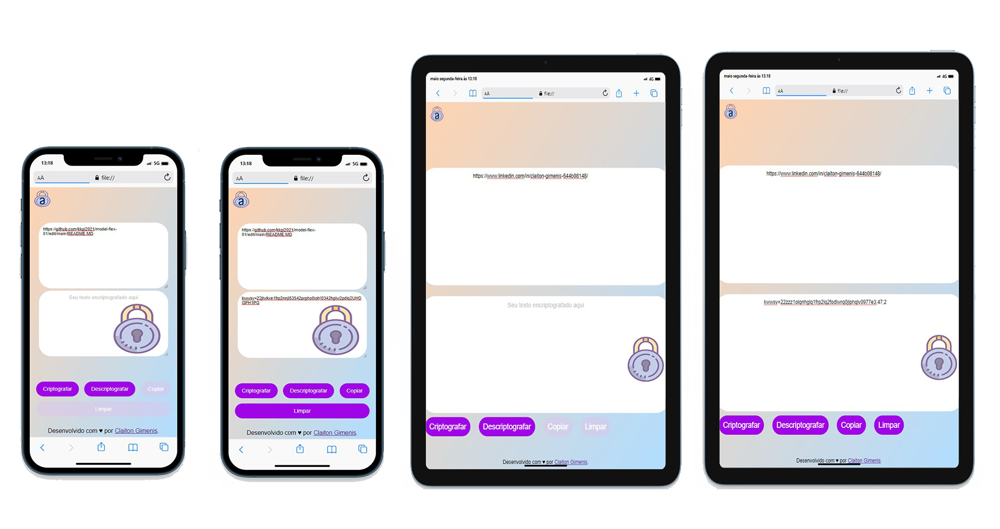

# Onecrypt

Este projeto consiste em uma aplicação web simples que permite ao usuário inserir um texto e criptografá-lo usando um algoritmo de criptografia simples. O projeto foi desenvolvido com HTML, CSS e JavaScript e é compatível com dispositivos desktop e móveis.

## Screenshots  
  

## Acesse o link da aplicação: [Onecrypt](https://kkgi2021.github.io/challenge-Encriptador/)

## Funcionalidades
- Permite inserir um texto na área de entrada de texto.
- Criptografa o texto inserido pelo usuário ao clicar no botão "Criptografar".
- Descriptografa o texto criptografado ao clicar no botão "Descriptografar".
- Copia o texto criptografado ou descriptografado para a área de transferência ao clicar no botão "Copiar".
- Limpa a área de entrada de texto e a área de saída ao clicar no botão "Limpar".

## Como usar
1. Abra o arquivo index.html em um navegador da web.
2. Insira o texto a ser criptografado na área de entrada de texto. Certifique-se de digitar com letras minúsculas e sem acentos.
3. Clique no botão "Criptografar" para criptografar o texto.
4. Clique no botão "Descriptografar" para descriptografar o texto.
5. Clique no botão "Copiar" para copiar o texto criptografado ou descriptografado para a área de transferência.
6. Clique no botão "Limpar" para limpar a área de entrada de texto e a área de saída.

## Autor
Este projeto foi desenvolvido por Claiton Gimenis. Você pode acessar o perfil do autor no [GitHub](https://github.com/kkgi2021).

## Documentation  
[Documentation](doc.md)  
                 